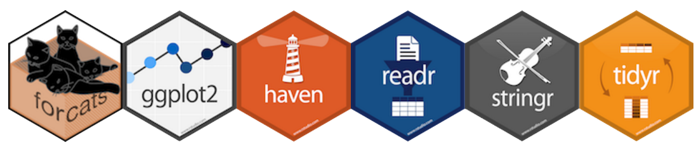

```{r setup, include=FALSE}
knitr::opts_chunk$set(echo = FALSE)
```

## Contenido

-   R y Rstudio

-   Instalación

-   Conceptos fundamentales

# R y Rstudio

## R

### R y sus usuarios

R es un lenguaje de programación y entorno computacional enfocado en estadística. A diferencia de otros lenguajes, R se diseñó exclusivamente para tareas estadísticas. Instalar R en una computadora implica configurar el entorno computacional necesario para escribir y ejecutar instrucciones en código.

## Rstudio

{.imagen style=".imagen{margin-left: auto; margin-right: auto;" width="208"}

### Rstudio - un IDE para R

Se puede usar `R` directamente, pero para trabajar con proyecto es recomendable utilizar `Rstudio`, que es un entorno integrado de desarrollo (IDE, por su siglas en inglés).

## ¿Para que se usa R?

### Usos de R más comunes

-   **Manipulación de datos**: R ofrece herramientas para limpiar, transformar y manipular datos, incluyendo la biblioteca dplyr.

-   **Visualización interactiva**: Crear visualizaciones interactivas y dashboards con bibliotecas como `Shiny`.

-   **Estadísticas descriptivas**: Realizar análisis de estadísticas descriptivas, como cálculos de media, mediana, moda, desviación estándar, etc.

# Instalación

## Sistemas operativos

Funcional en:

-   Windows

-   macOS

-   Linux

Page of Posit

1.  R: <https://cran.r-project.org/bin/windows/base/>

2.  Rstudio: <https://posit.co/downloads/>

# Conceptos fundamentales

## Consola

### Entorno computacional

La consola de `R` veremos donde es ejecutado, solo nos dará el resultado de lo que pidamos allí mismo. En `R`, *ejecutar*, *llamar* o *correr* implica dar una instrucción o entrada al programa para que realice una tarea en específica.

## Scripts

Los scripts son archivos de texto con extensión `.R` que contienen código que R puede leer y ejecutar.

### Directorio de trabajo

El directorio de trabajo en R es donde se encuentran los archivos con los que se trabaja y es el lugar predeterminado para importar y exportar archivos, a menos que se indique lo contrario. Para consultar tu directorio de trabajo utiliza `getwd()`

## Constantes y variables

Así como en matemáticas, una **`constante`** es un valor inmutable, mientras que una **`variable`** es un contenedor que puede cambiar de valor durante la ejecución de un programa.

### Ejemplo

$$a = \pi r^2$$

Donde $\pi$ y 2 son constantes, en cambio `a` y `r` son las variables.

## Asignaciones

Para asignar usaremos `<-`, si queremos asignarle el valor de `10` a `chicle` la forma adecuada es:

```{r, echo=TRUE}
chicle <- 10
chicle
```

### Consideraciones

Crear una variable suele ser muy fácil, pero se debe tener en cuenta que los nombres deben de ser [claros]{.smallcaps}, [no ambiguos]{.smallcaps} y [descriptivos]{.smallcaps}.

## Funciones y documentación

Las funciones son operaciones que requieren argumentos para ejecutarse y su nombre generalmente indica su propósito. Funciones comunes:

1.  `mean()`

2.  `median()`

3.  `quantile()`

4.  `sum()`

### Documentación

Accede a la información de una función o a un paquete con `?mean` o utilizando `help`.

```{r, eval=FALSE}
help("mean") # Similar a ?mean
```

## Paquetes

*R se expande con paquetes que son colecciones de funciones diseñadas para tareas específicas. Para instalar un paquete, se usa `install.packages()` y para utilizarlo, se emplea `library()`. Es importante recordar que debes cargar el paquete con `library()` cada vez que inicies una sesión en R, ya que las sesiones comienzan con funciones y objetos básicos.*



# Tipos de datos en R

## Tipos de datos

Los tipos de datos más común en R son:

| Tipo            | Ejemplo | Nombre en inglés |
|-----------------|---------|------------------|
| Entero          | 1       | integer          |
| Numérico        | 1.3     | numeric          |
| Cadena de texto | "uno"   | character        |
| Factor          | uno     | factor           |
| Lógico          | TRUE    | logical          |
| Perdido         | `NA`    | NA               |
| Vacio           | `NULL`  | null             |

Para consultar el tipo de datos, usaremos la función `class()`

## Coerción

Podemos manipular los datos en `R`, o más precisamente, realizar conversiones forzadas de un tipo a otro utilizando las funciones de la familia `as`: `as.interger(), as.numeric(), as.character(), as.factor(), as.logical(), as.null()` . Todas estas funciones trabajan con datos y vectores.

**Ejemplos:**

```{r, echo=TRUE}
as.character(5)
as.logical(1)
```

# Operadores 

## Operadores aritméticos 

Tal como sugiere su nombre, estos operadores se emplea específicamente para realizar cálculos aritméticos. Es factible efectuar estas operaciones utilizando datos tanto enteros como numéricos.

| Operador | Operación       | Ejemplo | Resultado  |
|----------|-----------------|---------|------------|
| `+`      | Suma            | `5+3`   | `8`        |
| `-`      | Resta           | `5-3`   | `2`        |
| `*`      | Multiplicación  | `5*3`   | `15`       |
| `/`      | División        | `5/3`   | `1.666667` |
| `^`      | Potencia        | `5^3`   | `125`      |
| `%%`     | División entera | `5%%3`  | `2`        |

## Operadores relacionados

Se usan los operadores lógicos para hacer comparaciones y su resultado siempre será `TRUE` o `FALSE` (verdadero o flaso, respectivamente)

| Operador | Comparación            | Ejemplo  | Resultado |
|----------|------------------------|----------|-----------|
| `<`      | Menor que              | `5 < 3`  | `FALSE`   |
| `<=`     | Menor o igual que      | `5 <= 3` | `FALSE`   |
| `>`      | Mayor que              | `5 > 3`  | `TRUE`    |
| `>=`     | Mayor o igual que      | `5 >= 3` | `TRUE`    |
| `==`     | Exactamente igual que  | `5 == 3` | `FALSE`   |
| `!=`     | No es igual que        | `5 != 3` | `TRUE`    |

: Casi siempre cuando se hacen comparaciones siempre obtendremos TRUE o FALSE.

## Operadores lógicos

Los operadores lógicos son usados para describir relaciones lógicas, expresadas como verdadero o falso.

| Operador | Comparación              |
|----------|--------------------------|
| `x | y`  | `x` ó `y` es verdadero   |
| `x & y`  | `x` Y `y` son verdaderos |
| `!x`     | `x` no es verdadero      |

### Advertencia

-   `|` devuelve `TRUE` si alguno de los datos es `TRUE`

-   `&` solo devuelve `TRUE` si ambos datos es `TRUE`

-   `|` solo devuelve `FALSE` si ambos datos son `FALSE`

-   `&` devuelve `FALSE` si alguno de los datos es `FALSE`

## Operadores de asignación 

Los operadores de asignación son los más importantes, nos permiten asignar datos a variables. Se recomienda utilizar `<-` a la hora de asignar.

```{r, echo=TRUE}
juan <- 5
jose =  5
```

### Orden de operaciones

1.   `^`

2.  `*` `/`

3.  `+` `-`

4.  `<` `>` `<=` `>=` `==` `!=`

# Estructuras de datos

## Vectores

Un vector es una colección de uno o más datos del mismo tipos. Los vectores siempre tienen tres propiedades:

1.  **Tipo**

2.  **Longitud**

3.  **Atributos**

```{r, echo=TRUE}
vec <- 1 # Crear un vector
# Vectores de más de un elemento usar c()
vector1 <- c(1,3,4,5,6)
vector2 <- 1:10

vector2 + 2 # Vectorización

```

## Data frames

Los data frames son como tablas de datos bidimensionales que pueden contener diferentes tipos de datos en sus celdas, lo que los hace heterogéneos. Son ampliamente utilizados en análisis de datos y son similares a las matrices, pero con la flexibilidad de admitir tipos de datos mixtos en filas diferentes, aunque mantienen la restricción de que cada columna debe contener un solo tipo de dato.

```{r}
head(iris, n = c(3,3))
```

# Gráficos

## Distribuciones

```{r,fig.align='left',fig.height=3, fig.width=3 }
library(ggplot2)

# Generar datos de una distribución normal
datos_normal <- data.frame(x = rnorm(1000, mean = 0, sd = 1))


# Crear un histograma
ggplot(datos_normal, aes(x)) +
  geom_density(color = "black", fill = "#0466c8") +
  labs(title = "Distribución Normal", x = "Valor", y = "Frecuencia") + theme_classic()
```
