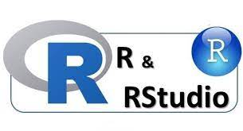

```{r setup, include=FALSE}
knitr::opts_chunk$set(echo = TRUE)
```

## Introducción

R es un lenguaje de programación y entorno computacional enfocado en estadística. A diferencia de otros lenguajes, `R` se diseñó exclusivamente para tareas estadísticas. Instalar `R` en una computadora implica configurar el entorno computacional necesario para escribir y ejecutar instrucciones en código.

Aunque `R` puede parecer peculiar para aquellos con experiencia en otros lenguajes, su enfoque específico en estadística lo convierte en una herramienta poderosa para profesionales en esta disciplina. Su origen se remonta a la necesidad de satisfacer las demandas de análisis estadístico especializado.

## R y Rstudio

{style="text-align: center;" width="317"}

Se recomienda utilizar un entorno integrado de desarrollo (IDE) al trabajar con `R` en lugar de ejecutar código directamente desde documentos de texto plano, ya que es más efectivo, especialmente en proyectos complejos. Un IDE ofrece herramientas para escribir, revisar y administrar el código, así como para gestionar el entorno de trabajo y mejorar la productividad. `RStudio` es una opción preferida debido a su capacidad para hacer que `R` sea más accesible, enfocándose en la colaboración y la reproducción de análisis.
